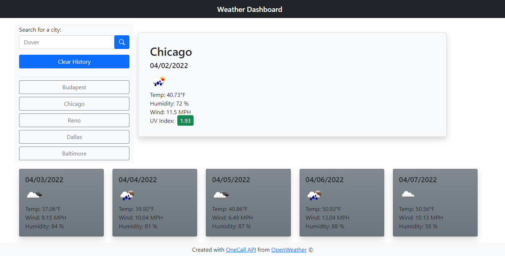
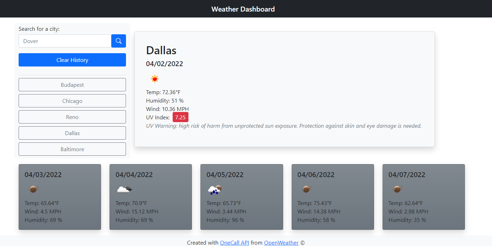

# Weather Dashboard

## Application Info

Weather Dashboard is a simple in-browser app that allows a user to find forecast information for any searched city. A user can search for a city's forecast by its name in the search field, and be shown its current weather forecast, along with the future 5-day forecast. Weather icons make quick work of identifying whether it will be clear, cloudy, rainy, etc. Search history is saved for quick recall, and a "Clear History" button is available to clear recent searches.

### Features

- Search for a city from OpenWeather's extensive database
- Get the current forecast for that city including:
    - Temperature
    - Wind Speed
    - Humidity Level (%)
    - UV Index
    - Weather Condition Icon
- UV Index color coded based on favorable, moderate, or severe levels, according to the U.S. EPA websites UV Index
- Get the future 5-day forecast for that city
- Searched cities are locally stored and displayed as buttons to allow the user to quickly find it's forecast again
- Clear search history from local storage

<br>

***

<br>

### Project Info

```
Server Side API project for GWU's Coding Bootcamp 2022

- Created with HTML, BootStrap, JavaScript, jQuery
- Utilizes OpenWeather's One Call API
- Focus on API utilization and dynamic HTML creation
    - Navigating API documentation, calling endpoint data for dynamic display
```

Deployed URL: https://blindsweatyhansolo.github.io/weatherdashboard/

GitHub Repo: https://github.com/blindsweatyhansolo/weatherdashboard/

Screenshots:



;